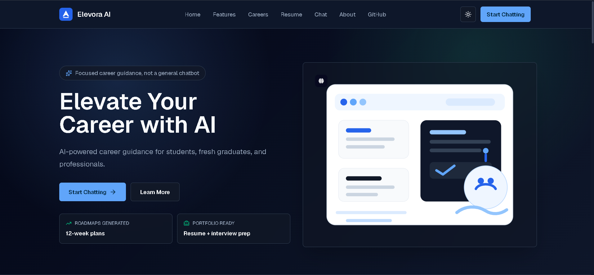
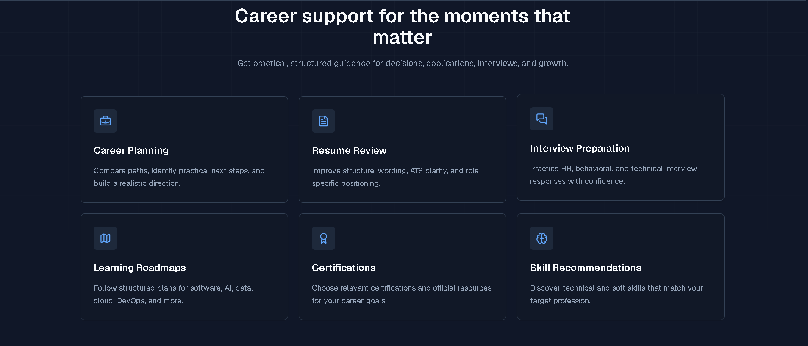
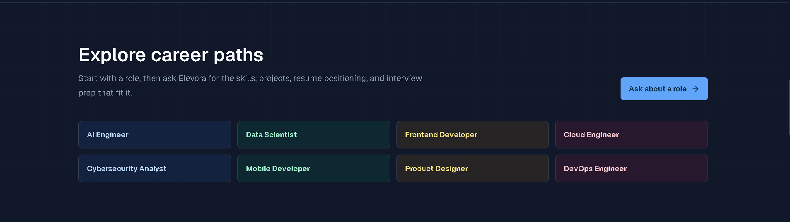
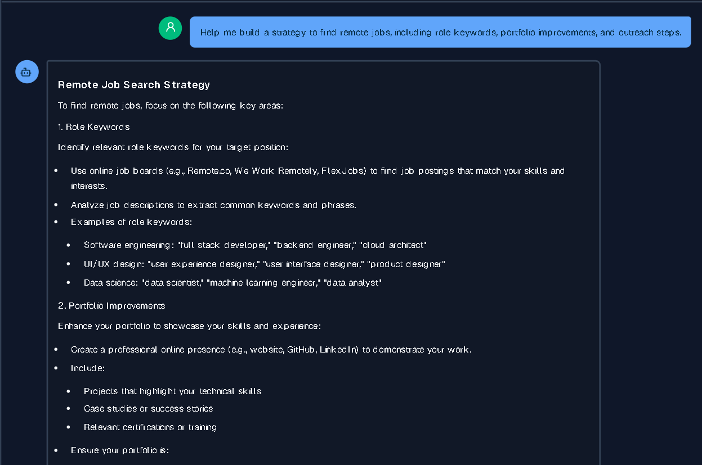
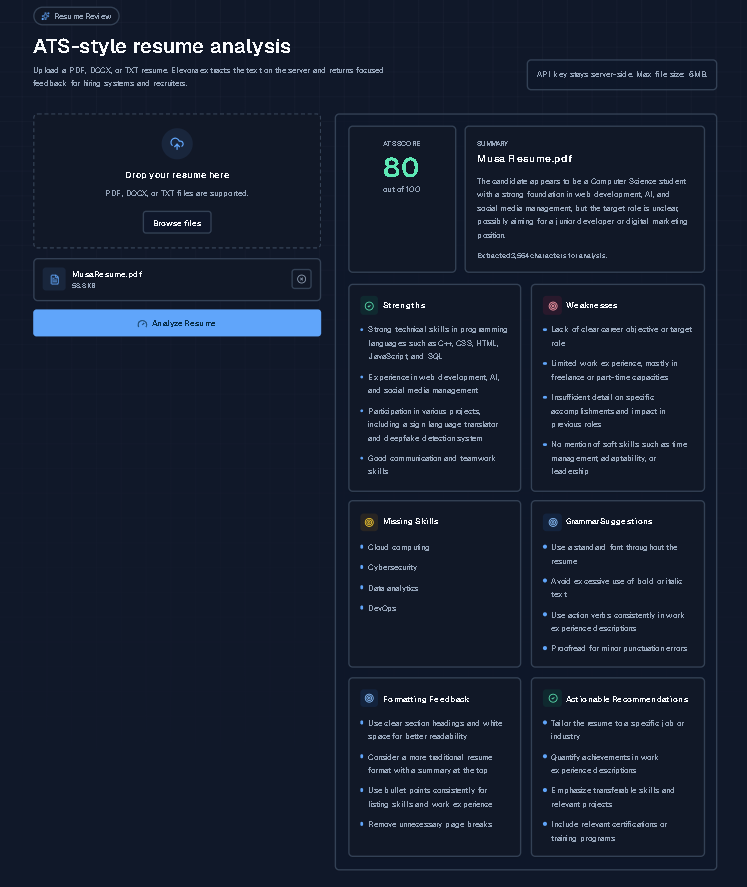
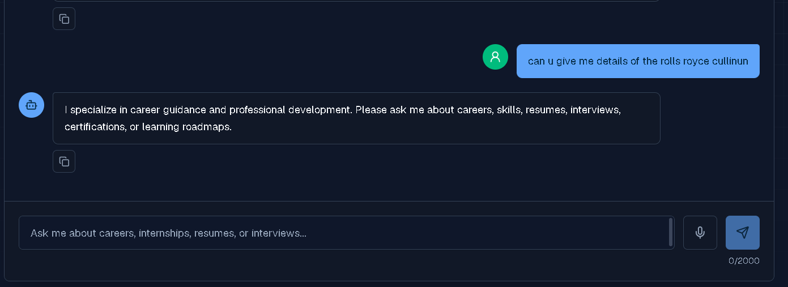

# Elevora AI

Elevora AI is a production-focused AI Career Guidance Assistant for students, fresh graduates, job seekers, career changers, and professionals. It provides focused support for career planning, resumes, interviews, internships, portfolios, LinkedIn, certifications, skill recommendations, and learning roadmaps.

The assistant is intentionally not a general chatbot. Out-of-scope questions are politely declined.

## Features

- Modern SaaS-style landing page
- Responsive light and dark theme with persisted preference
- Career-only AI chat interface
- Suggested prompts for common career goals
- Session-only conversation context
- Markdown rendering for assistant responses
- Syntax highlighted code blocks with copy actions
- Assistant response copy button
- Clear chat confirmation
- Friendly validation, network, rate limit, and API error states
- Server-only Groq integration through `POST /api/chat`

## Tech Stack

- Next.js 15 App Router
- React 19
- TypeScript strict mode
- Tailwind CSS
- Lucide React
- next-themes
- Framer Motion
- react-markdown
- react-syntax-highlighter
- Groq SDK
- Sonner toasts

## Installation

```bash
npm install
```

## Environment Variables

Create `.env.local` in the project root:

```bash
GROQ_API_KEY=your_groq_api_key
GROQ_MODEL=llama-3.3-70b-versatile
```

`GROQ_MODEL` is optional. If omitted, the application uses `llama-3.3-70b-versatile`.

## Local Development

```bash
npm run dev
```

For local development, Next.js will print the local preview URL in the terminal.

## Production Build

```bash
npm run build
npm run start
```

## Deployment

The app is deployed on Vercel. Add the live Vercel URL here:

```bash
https://innoviast-elevora-ai.vercel.app/
```

Configure these environment variables in Vercel before deploying:

- `GROQ_API_KEY`
- `GROQ_MODEL`

The browser never calls Groq directly. All AI requests go through the Next.js route handler at `/api/chat`.

## Screenshots

### Home



### Features



### Careers



### Chatbot



### Resume Analyzer



### Error Handling



## Future Improvements

- Authentication
- Persistent saved conversations
- Interview simulator
- Career assessment quiz
- Dashboard
- Multi-language support
- Voice input and responses
- PDF export
